`z<u>` 下划线 `</u>`

# 一级标题

## 二级标题

~~删除线~~
_斜体_

**加粗**

**_斜体加粗_**

- 11
- ss
- faf

1. 哈
2. 哈哈
3. 安抚哈佛哈

```js
// 代码段
let name = {};
```

---

---

[link 跳转](www.baidu.com)

---

---

---

# CSS

## @import 简化页面

- @import url() all
- @import url() screen
- @import utl() print

## @media 定义局部响应式布局

- @media screen add(max-width:600){

  .nav{

  }

  }

## AND 条件判断响应式

```js
//多个media属性合在一起使用
```

## 根选择器

```js
//选中html元素
:root{
    background:orange;
}
```

## 兄弟选择器

```js
//h1后面的所有h2兄弟元素被选中
h1~h2{

}或
//h1后面的紧挨着的h2兄弟元素被选中（只会选中最近的h2）
h1+h2{

}

```

## 属性选择器

```js
//选中有title属性的元素
h1[title]{

}
//选中title=‘wxx’的元素
h1[title='wxx']{

}

//通配符选中title含有‘w’的元素
h1[title*='w']{

}
//通配符选中title以‘w’开始的元素
h1[title~='w']{

}
```

## 结构伪类选择器

```js
//选中有title属性的元素
h1[title]{
}
//选中title=‘wxx’的元素
h1[title='wxx']{
}
//通配符选中title含有‘w’的元素
h1[title*='w']{
}
//通配符选中title以‘w’开始的元素
h1[title~='w']{
}//选中有title属性的元素
h1[title]{
}
//选中title=‘wxx’的元素
h1[title='wxx']{
}
//通配符选中title含有‘w’的元素
h1[title*='w']{
}
//通配符选中title以‘w’开始的元素
h1[title~='w']{
}
```

## 排除选择器

```js
:not(:first-child) //排除第一个元素
```

## 空选择器

```js
//:empty选择器表示的就是空。
//用来选择没有任何内容的元素，这里没有内容指的是一点内容都没有，哪怕是一个空格。
h2:empty{
    display:none;
    border:1px solid green;
}
```

## ::selection 选择器

```js
//“::selection”伪元素是用来匹配突出显示的文本(用鼠标选择文本时的文本)。
//浏览器默认情况下，用鼠标选择网页文本是以“深蓝的背景，白色的字体”显示的
::selection{
   background: orange;
   color: green;
}
```

## 样式权重

```js
可以继承（继承的样式没有权重）：
    font
    color
    .
    .
不能继承:
    border
    .
    .
```

```js
通配符的权重（权重为0）：
    *{

    }
通配符权重>继承的样式权重
```

```js
强制权重优先级：
	.c{
        color:red !important;
    }
```

## 字体

```js
*{
    font-style：italic
    font-size
    font-family
    line-height
    font-weight
    font-variant:lowercase/upcase/... //小型大写/首字母大写/...
}
<em>  //强调加粗

```

## 文字镜像

```js
  span {
            display: block;
            -webkit-box-reflect: below 5px -webkit-gradient(linear, 0% 0%, 0% 100%, from(rgba(0, 0, 0, 0)), to(rgba(255, 255, 255, 0.2)));
            visibility: visible;
        }
```

## 文本线条

```js
*{
    text-decoration:none//下划线
 }
```

## 文本阴影

```js
h2{
    text-shadow:2px 2px 2px 2px rgba(2,2,2,.2) inset //x y 模糊距离 模糊大小 颜色  向内阴影
}
```

## 文本溢出和空白处理技巧

```js
h2{
    white-space//处理空白的样式
    white-space:nowarp//规定文本不换行
}
//注意：弹性盒场景下会失效
文本溢出省略号：
h2{
    overflow:hidden;
    text-overflow:ellipsis;
    white-space:nowrap;
}
文本与图片对齐：
img{
    vertical-align:middle/top/bottom...
}

```

## 文本缩进

```js
h2{
    font-size:14px;
    text-indent:2em;//缩进2字符
}
h2{
    text-align:center//文本中心对齐
}
```

## 背景模糊

```js
//背景固定，背景的宽高要和图片一致
//在添加另外一个元素（即为滤镜），给它设透明度和模糊值
//给背景和滤镜设置z-index:-1, 使用负值降低优先级,防止添加在模糊图片上的文字图片模糊
// css 
.box {
    position: relative;
    margin-bottom: 10px;
    .inner {
      position: absolute;
      top: 0;
      left: 0;
      bottom: 0;
      right: 0;
      z-index: -1;
    }
    .inner {
      background: rgba(0, 0, 0, 0.5);
      backdrop-filter: blur(5px);
    }
  }
  
  // html
  <div class="box">
          <div class="inner"></div>
          <div class="con1">
          <!-- 内容...><-->
          </div>
  </div>
```


## 字符间距与排序

```js
h2{
    letter-spacing:20px;//控制字符间距
    word-spacing:30px;//控制每个单词间距
    writing-mode:vertical-rl//文字从上到下竖直排序
}
```

## 宽高比

```js
// 设置宽高比
// 宽高比 = 1
h3{
    aspect-ratio: 1;
}
```

## 轮廓线

```js
//轮廓线在边线外围
h2{
    outline-style //线形状
    outline-width
    outline-color
    outline:none
}
```

## 表格 table

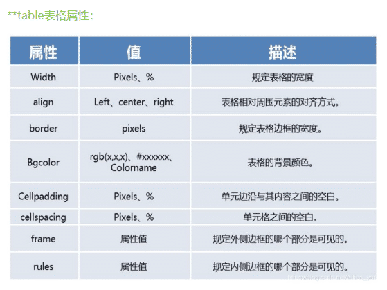

```js
// th的高度自适应(设置th的vertical-align)
<table>
	<tr>
        <th>电压等级</th>
        <td>作业单位作业单位作业单位作业单位作业单位作业单位作业单位</td>
        <th>关联线路</th>
        <td>作业单位作业单位作业单位作业单位作业单位</td>
    </tr>
</table>

css:
    table {
      border-collapse: collapse;
      border: 1px solid #444;
      font-size: 12px;
    }
    th,
    td {
      padding: 10px 5px;
      border: 1px solid #444;
      border-spacing: 0px;
    }
    th {
      width: 65px;
      height: 100%;
      vertical-align: middle;// 通过设置th的vertical-align,让th的文字垂直居中，自适应高度的变化
    }
```

## el-table高度问题

```js
// 当f0含有多个子元素(f1、f11等)，子元素f1中有表格、分页，这样写表格的高度动态变化
div.f0
    div.f1
       el-table
       el-pagination
    div.f11

样式写法：
.f0{
    display:flex;
    flex-direction:column;
    overflow:hidden;
      .f1{
          flex:1;
          .el-table{
              height:calc(100% - 50px);
          }
          .el-pagination{
              height:50px;
          }
  	   }
      .f11{
          height:400px;
      }
}

```


## 元素显隐

```js
h2{
    display:none;
    visibility:hidden;
    opacity:0;
}
```

## fill-available

```js
//fill-available只针对块级盒子
h2{
    height:fill-available//自动撑满
    width:max-content//宽度根据内容大小自适
}
```

## xx-content

```js
//fit-content自动撑开div宽度，而不至于让div独占一行
div{
    width:fit-content;
    margin:auto;
}
//max-content
div{
    width:max-content;
}

//min-content
div{
    width:min-content;
}

```

## 背景

```
//设置元素背景图片的原始起始位置。
background-origin： border-box | padding-box | content-box | no-clip
```

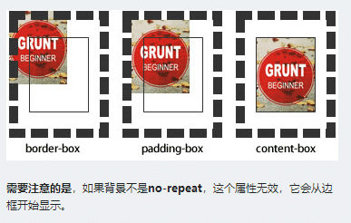

```
//用来将背景图片做适当的裁剪以适应实际需要。
background-clip ： border-box | padding-box | content-box | no-clip
```

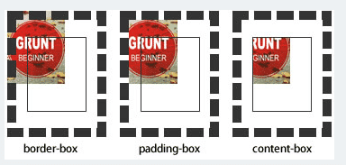

```js
//背景裁切 ：背景在盒子中的显示范围
h2{
    background-clip:content-box/padding-box/border-box  //显示在(内容/padding/边框)位置
}
//背景滚动
h2{
    background-attachment:fixed/scroll  //背景在盒子中固定或者随滚动条滚动
}
//位置
h2{
    background-position: top left; //位置名字组合定位，只写一个默认另一个为居中
}
//背景重复
h2{
    background-repeat:no-repeat;//不重复
    background-size:cover/contain; //背景尺寸设置像素大小，只写一个默认另一个为auto，cover(常用)填充整个盒子，contain将图片缩放至某一边紧贴容器边缘为止
    box-shadow:0 0 5px rgb(2,2,2) ;
}
//背景颜色线性渐变 ，角度为顺时针计算
h2{
    background:linear-gradient(red,green,blue) //默认，从下向上
    background:linear-gradient(to left,red,green,blue)//线性渐变,从左向右
    background:linear-gradient(90deg,red,green,blue)//设置线性渐变顺时针旋转角度，从左向右
}
//径向渐变
h2{
    background:radial-gradient(20px 50px,red,green,blue)//径向渐变
}
//可同时设置多个背景图片
组合写法：颜色 路径 重复 位置/大小
```

## 边框阴影

```js
h2{
    ////注意：inset 可以写在参数的第一个或最后一个，其它位置是无效的。
    //如果添加多个阴影，只需用逗号隔开即可
    //box-shadow: X轴偏移量 Y轴偏移量 [阴影模糊半径] [阴影扩展] [阴影颜色] [投影方式];
    box-shadow:0px 0px 6px 6px #ccc inset,0px 0px 6px #333;
}
```

## 边框背景图片

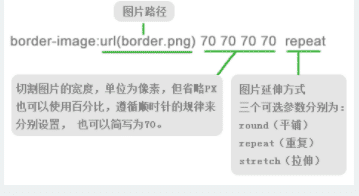

```js
h2{
    border-image:url(xxxx) 20 repeat;//
}
```

## 清除浮动

```js
//伪元素清除浮动
h2{

}
h2::after{
    content:'';
    clear:both;
    display:block;
}
//overflow清除浮动
h2{
   overflow:hidden;
}
```

## 定位

```js
//注意：滚动条会对定位造成影响

 h2{
     position:relative/absolute/fixed
 }

//粘性定位
h2{
    position:sticky;
}

```

## 过渡

```js
h2{
    transition-duration:2s;//设置过渡时间
    transition-property:all/none/color/width... //设置可以过渡的属性
    transition-timing-function:ease/linear/ease-in/steps(3,end)... //设置过渡的运动轨迹,steps()设置步进帧动画
    transition-delay:2s;//设置过渡动画的延迟时间
}
```

## 动画

```js
//定义动画
@keyframes hd{
    //初始
    from{
        color:green;
    }
    50%{
        color:blue;
        transform:translateX(300px)
    }
    //终点
    to{
        color:red;
        transform:translate(200px,100px)
    }
}
h2{
    animation-name:hd;
    animation-duration:2s ,1s;//定义多个动画持续时间
    animation-delay:1s,2s;//定义多个动画的延迟时间
    animation-iteration-count:2/，infinite无限; //设置动画的执行次数，infinite无限
    animation-direction:normal/reverse/alternate;//normal和reverse设置动画执行的起始方向,alternate和alternate-reverse控制动画平滑轮回执行
    animation-timing-function:steps(4,end);//动画步进帧执行
    animation-play-state:running/pause;//设置动画的暂停、运动
    animation-fill-mode:forwards//动画填充模式
}
```

## 弹性布局flex

```js
//弹性盒子为块级元素
//声明
//注意:需要弄清弹性盒(也叫弹性容器)和弹性元素的概念区别
h2{
    display:flex/inline-block;//块级弹性盒/行内弹性盒
}

//具体的弹性盒（弹性容器）属性设置
h2{
    display:flex;
    flex-direction:row/column/row-reverse/column-reverse; //设置弹性元素方向行、列、反向行、反向列
    flex-wrap:wrap/no-wrap/wrap-reverse;//弹性盒溢出换行处理
    flex-flow:row wrap  //flex-direction和flex-wrap简写

    justify-content:flex-start/center/flex-end/space-around/space-between/space-evenly //设置主轴的排列方式 space-evenly设置完全平均分布
    align-items:flex-start/flex-end/center/stretch... //设置交叉轴排列方式(flex-wrap不换行时)
    align-content:start/center/end/space-around/space-between... //设置多行元素在交叉轴的排列方式
}

//具体的弹性元素(弹性容器的子元素)属性设置
h3{
    align-self:flex-start/flex-end/stretch...;//对单个弹性元素交叉轴排列方式进行控制
    flex-grow:1/2...;//设置子元素分配剩余空间  元素会放大
    flex-grow:0;//设置该子元素不分配剩余空间
    flex-shrink:0;//设置元素缩小比例  元素会缩小
    flex-basic:100px;//设置主轴的基准尺寸为100px

    //弹性元素属性的组合定义
    flex:1 2 100px

    order：0/1/2... //控制弹性元素在弹性容器中的排序

    //注意：弹性元素设置绝对定位时，因为绝对定位后失去了正常的空间位，将不受弹性盒属性影响
}

```

## Grid布局

```js


.con{
     display: grid;
     grid-template-columns:1fr 1fr 2fr 200px;// 默认4个子盒子一排，对应数值宽度
     grid-template-columns: repeat(4, 1fr);// 默认4个子盒子一排，宽度自动占满
     grid-template-columns: repeat(auto-fill, minmax(200px, 1fr)); // 响应式布局，子盒子最小宽度200px
     gap: 20px; // 设置间隔20px,类似margin:10px
}


```


## 滤镜

```js
h2{
    filter:blur(5px);
}
```

## 扭曲 skew()

```js
//扭曲skew()函数能够让元素倾斜显示
//这与rotate()函数的旋转不同，rotate()函数只是旋转，而不会改变元素的形状。
//skew()函数不会旋转，而只会改变元素的形状。
h2{
    transform:skew(20deg,30deg);
}
```

## attr()函数

```js
<h2 wxx="hahaha"></h2>

h2::after{
    content:attr(wxx);//等效与 content:'hahaha'
    ...
}
```

## var()函数

```js
//定义一个名为 "--main-bg-color" 的属性，然后使用 var() 函数调用该属性
:root {
  --main-bg-color: coral;
}

h2 {
  background-color: var(--main-bg-color);
}
```

## 小于 12px 文字生成器

```js
https://qishaoxuan.github.io/css_tricks/smallFont/
//使用 svg 作为解决小于 12px 字号文字的方案：
    //1.使用 transform: scale() 设置后占位区域并没有改变，难以调节对齐方式。
    //2.使用 canvas 无法选中文字（也可以解决，但不如 svg 简洁）
```

## dom 监听事件

```js

```

[link 详情](https://www.cnblogs.com/summerxbc/p/13865952.html)

## H5 新增标签

```js
// 新增标签
```

## class获得父元素

```js
// :has伪元素
:has(.custom-tree-node) {
            background: #e6f5f3;
 }
```


# **_javascript_**

## 数据类型

```js
//五种基本类型
//String Number boolean undefined null

//其他都为Object

//typeof(xx)  检查数据类型

//undefined == null 结果为true

//将类型转为字符类型 toString()不能用在null、undefined上
xx.toString()、 Strign(xx)、 xx + ''

//转为是数字
Number(xx)、xx * 1、parseInt(xx)、parseFloat(xx)

//转为布尔
Boolean(xx)

//内置对象
Date Math Array Error Reg

```

## 数组挖掘

- arr1.copyWithin([1,2,3]) 数组复制
- find() 数组查找
- findIndex() 查找下标
- includes() 数组查找
- indexOf() 数组查找
- lastIndexOf() 从后查找数组索引
- sort(()=>a-b) 按倒叙排序
- forEach() 遍历数组，return 跳出本次循环，trycatch 结束当前循环
- every() some() 返回 boolean
- filter() 按条件过滤并返回新数组
- map() 遍历数组并返回新数组
- reduce((pre,next,index)=>{},[]) ==pre-前一次执行 reduce 返回的对象，next-本次(将要)执行 reduce 函数的对象，index 当前索引==
- pop() 删除数组最后一个元素，并返回原数组
- push() 在数组后面添加元素
- shift() 删除数组第一个元素，并返回原数组
- unshift() 在数组前面添加元素
- slice(start,opt_end) 返回新数组，并且不会改变原数组,opt_end 可以为负值
- splice(index,opt_length，opt_new) 返回新数组，并且修改原数组，opt_new 作为第三个参数时可以向原数组添加元素
- 
- 

## 清空数组

```js
let hd = [1, 2];
//1.
while (hd.pop()) {}
//2.
hd = [];
//3
hd.length = 0;
```

## 数组拆分合并

```js
let arr = [1, 2];
let hd = [3, 4];

arr = arr.concat(hd); //合并
arr = [...arr, ...hd]; //合并
arr.copyWithin(hd); //合并
```

## 跳出指定 for 循环

```js
//为循环语句创建一个label，来标识当前的循环
outer: for (var i = 0; i < 10; i++) {
  for (var j = 0; j < 10; j++) {
    if (j == 5) {
      break outer;
    }
    console.log(j);
  }
}
```

## for in 和 for of

```js
// for of只能遍历可迭代的变量，所以对对象不可以使用for of
for (let key in arr) {
  //key-键
}
for (let key in obj) {
  //key-键
}
// 不可遍历对象obj
for (let value of arr) {
  //value-值
}
```

## Object.entries()

```js
//Object.entries()方法返回一个给定对象自身可枚举属性的键值对数组，其排列与使用for…in循环遍历该对象时返回的顺序一致。
//区别在于forin 会枚举原型链上的属性。  
let per = {
    name:'zdx',
    age: 18
  }

  for(let [key,value] of Object.entries(per)){
    console.log(key,value);
  }
  //name,zdx
  //age,18

```

## slice、substring、substr

```js
string.slice(start, end); //提取一个字符串,end支持负数
string.substring(start, end); //提取一个字符串,end不支持负数
string.substr(start, len); //提取一个长度为len的字符串
```

## forEach

```js
//forEach可以通过return跳出本次循环，不可以用break,会报错
//将每次循环当作在一个匿名函数中执行
arr.forEach(item=>{
    if(false){
        return
    }
    ...
})

//可以使用trycatch结束循环
//结束整个循环
try{
    arr.forEach(item=>{
        if(**){
           throw('打印：循环结束')
           }
    })
}catch(e){
    console.log(e) //打印：循环结束
}
```

## Symbol()

```js
//在程序中永远不会重复
//定义Symbol
let hd = Symbol("weixiaoxiang");
console.log(hd.toString()); //weixiaoxiang
console.log(Symbol.for(hd)); //weixiaoxiang
```

## Set 和 Map

```js
//Set 和 Map 主要的应用场景在于 数据重组 和 数据储存
//Set 是一种叫做集合的数据结构，Map 是一种叫做字典的数据结构

//Set 类似与数组
操作方法：
    add(value)：新增，相当于 array里的push
    delete(value)：存在即删除集合中value
    has(value)：判断集合中是否存在 value
    clear()：清空集合
遍历方法：
    keys()：返回一个包含集合中所有键的迭代器
    values()：返回一个包含集合中所有值得迭代器
    entries()：返回一个包含Set对象中所有元素得键值对迭代器
    forEach(callbackFn, thisArg)：用于对集合成员执行callbackFn操作


//Map 本质是键值对的集合，类似与对象集合，通过get 和 set读取数据
操作方法：
    set(key, value)：向字典中添加新元素
    get(key)：通过键查找特定的数值并返回
    has(key)：判断字典中是否存在键key
    delete(key)：通过键 key 从字典中移除对应的数据
    clear()：将这个字典中的所有元素删除
遍历方法：
    Keys()：将字典中包含的所有键名以迭代器形式返回
    values()：将字典中包含的所有数值以迭代器形式返回
    entries()：返回所有成员的迭代器
    forEach()：遍历字典的所有成员


```

## 数组去重

```js
 // 数组去重
 noRepeat(arr) {
      var newArr = [...new Set(arr)]; //利用了Set结构不能接收重复数据的特点
      return newArr;
 }
```


## async 和 defer

```js
async; //允许异步script文件
defer; //也允许异步加载script文件
```

## 对象

- Object.getOwnPropertyDescriptor(object1, 'property1') 获得对象属性

  ```js
  {
  configurable:true,//是否可以删除`
  enumerable:true,//是否可以枚举`
  value:'',//值`
  writeable:true//是否可以修改`
  }
  ```
- delete obj.name 删除对象 name 属性
- Object.hasOwnProperty() 判断对象是否包含特定的自身（非继承）属性
- 

## 探索 js 中函数的秘密

- call() 传参数 可以改变函数中 this 的指向 立即执行
- apply() 传数组 可以改变函数中 this 的指向 立即执行
- bind() 传参数 不立即执行
- call() bind() apply() 可以用于构造函数的继承

## 同步异步

- process.nexTick() setImmediate
- 同步任务>process.nexTick()>微任务>宏任务>setImmmediate() 当前事件任务循环
- async 函数返回值是 promise 对象

## 闭包

定义：函数嵌套函数，内部函数就是闭包

- 作用域链(重点理解):向上查找当前需要的变量或函数

利用闭包实现模块化开发，便于管理

## 堆栈内存概念

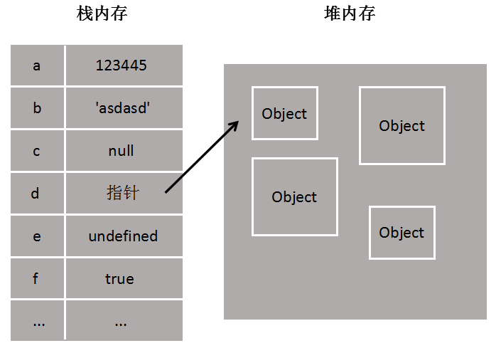

- 基本(原始)类型存在栈内存中，栈 stack 为自动分配的内存空间，它由系统自动释放；
- 引用类型存在堆内存中， 堆 heap 是动态分配的内存，大小不定也不会自动释放。

## 立即执行 a 函数

```js
//立即执行函数：函数定义完，立即被调用，这种函数叫做立即执行函数，立即执行函数往往只会执行一次
(function fun a(){})()
```

## 防抖和节流

- debounce ：只执行最后一次
- throttle ：控制执行次数

## 客户端渲染和服务端渲染

```js
//传统的SPA模式,即客户端渲染的模式
Vue.js构建的应用程序，默认情况下是有一个html模板页，然后通过webpack打包生成一堆js、css等等资源文件。然后塞到index.html中.
用户输入url访问页面 -> 先得到一个html模板页 -> 然后通过异步请求服务端数据 -> 得到服务端的数据 -> 渲染成局部页面 -> 用户

//SSR模式,即服务端渲染模式
用户输入url访问页面 -> 服务端接收到请求 -> 将对应请求的数据渲染完一个网页 -> 返回给用户
```

## toString()

- 当对 undefined、null 使用 tostring(),会报错

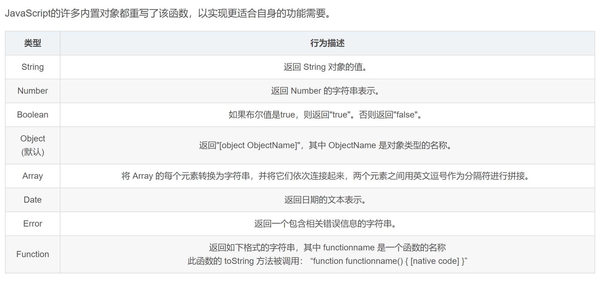

## 原型对象

- 每个对象都有其原型对象 `__proto__`
- 构造函数 prototype 属性
- 基于原型的继承

  ```js
  function User(name) {
    this.name = name;
    this.login = function () {
      console.log("我登陆了");
    };
  }
  function Admin(name) {
    this.name = name;
  }
  //让Admin的原型指向User的实例，实现Admin继承User
  Admin.prototype = new User();
  ```
- ==原型链==

  ```js

  ```

````


//类class
class Cat{

    constructor(name.age){

    }

}
````

- 类的继承

  ```js
  class Admin extend User{
     static xx = '' //静态属性
     constructor(name,age){
  		super()
      }
     login(){

     }
  }
  ```

## JIT-即时编译

```js
JavaScript是一门解释型语言，使用了JIT技术，使得运行速度得到改善
```

## js 预编译

```js
//https://www.bilibili.com/video/BV1sN411974w?p=6
```

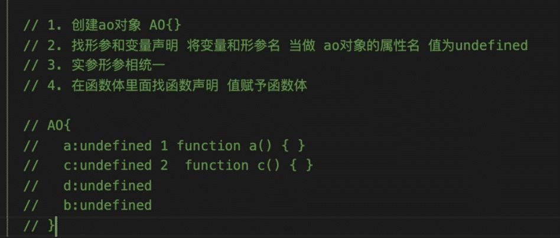

## lodashJS 库使用

```js
//https://blog.csdn.net/weixin_41229588/article/details/106334552

// 以 `user` 升序排序 再  `age` 以降序排序。
//_.orderBy(users, ['user', 'age'], ['asc', 'desc']);

//随机返回元素
//_.sample([1, 2, 3, 4]);
// => 2

//随机返回n个元素
//_.sampleSize([1, 2, 3], 2);
// => [3, 1]
```

## defineProperty()开启数据代理

```js
let obj = {}

Object.defineProperty(obj,'age',{
    configurable:false,
    enumerable:true,
    writable:true,
    value:18,
    get(){
        return xx;
    }
    set(value){
	...
	}
})
```

## Worker 实现 js 多线程

```
new Worker() 开辟出一个子线程，只能下载网络文件，不能读取本地文件
```

## 可选链操作符(?.)、空值合并操作符(??)

```js
// gtDetail?.nominalVoltage
解释：
	gtDetail?.nominalVoltage：这部分代码使用了可选链操作符。如果 gtDetail 是 null 或 undefined，则表达式立即返回 undefined，否则返回 gtDetail.nominalVoltage 的值。
// gtDetail?.nominalVoltage??""
    ?? ""：这部分代码使用了空值合并操作符。如果 gtDetail?.nominalVoltage 的值是 null 或 undefined，则表达式返回空字符串（""），否则返回 gtDetail?.nominalVoltage 的值。
    所以，整个表达式的意思是：如果 gtDetail 是 null 或 undefined，或者 gtDetail.nominalVoltage 是 null 或 undefined，则返回空字符串，否则返回 gtDetail.nominalVoltage 的值。

```

## Promise

```js
// 在promise中定义好异步
cancel() {
      // promise
      return Promise.resolve(
        new Promise((resolve) => {
          setTimeout(() => {
            ....
            console.log(1)
            resolve();
          }, 0);
        })
      );
},
// 在fn中同步使用
async fn(){
    await this.cancel()
    console.log(2)
}  
打印结果：先1后2，同步执行异步函数


```

## 阻止默认事件触发

```js
// 阻止默认事件
event.preventDefault()


```

## 其他

```js
1.history.scrollRestoration 取消浏览器对页面滚动条位置的记录
```

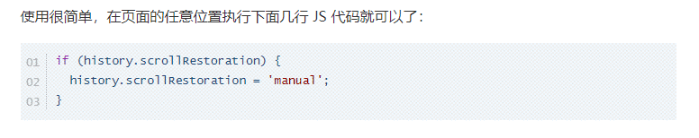

```

```

# TypeScript

## 类型声明

```js
let s: string;
let a: number;
let c: boolean;
function(a: string,b: string): string{
    return a+b;
}

let m = 100; // 直接定义变量并赋值的，不需要再声明变量类型

// 可以使用 | 来连接多个类型、值 (联合类型)
let a: string | number;
let a = 'male' | 'female'

// any表示任意类型，表示关闭该变量ts的类型检测
let d: any;

// unknown表示未知类型,实际就是有类型安全性的any
let e: unknown;
let s = e as string;
let ss = <string>e;

// void 用来表示函数没有返回值
function fn(): void{

}

// never 用来表示函数永远不会返回结果
function fn(): never{
    throw new Error('报错了')
}

// object: {}用于指定对象中可以包含哪些属性
let a: {namecv :string,age?: number，[propName: string]: any} // ?表示该属性可选,[propName:string]: any表示任意类型任意数量的属性

// 设置函数结构的类型声明
// 语法:(形参：类型，形参：类型)=>返回值类型
let d: (a: number,b: number)=>number

// number[] 表示数值数组
let a: number[]
a = [1,2,3,4,5]
// Array<number> 表示数值数组，泛型
let b: Array<number>
b = [1,2,3,4,5,6]

// enum枚举
enum Gender{
    Male=0,
    Female=1
}
let i: {name: string,gender: Gender}
i = {
    name:'wxx',
    gender: Gender.Male
}

// type:创建类型别名
type myType = 1 | 2 | 3 | 4;
let a: myType;
let b: myType;
```

## 命令

```js
tsc xx.ts // 编译ts文件
tsc xx.ts -w // 开启监听
```

## 抽象类

```js
// abstract声明抽象类，抽象类不能创建实例，只能用来子类继承
abstract class Animal{
   name: string;
   constructor(name: string){
       this.name = name;
   }
  // abstract定义抽象方法，抽象方法只能定义在抽象类中，并且子类必须实现该方法
   abstract sayHello(): void
}

class Cat extends Animal{
    // 子类必须实现父类的抽象方法
    sayHello(){
        console.log('hello')
    }
}
```

## 接口

```js
// interface定义 类的结构
interface obj {
  name: string;
  age: number;
}

interface myInter {
  name: string;
  sayHello(): void;
}
class MyClass implements myInter {
  name: string;
  constructor(name: string) {
    this.name = name;
  }
  sayHello() {
    console.log("hello");
  }
}
```

## 属性封装

```js
// private定义私有属性，只能在MyClass中访问
class MyClass{
    private _name: string;
    private _age: number;
    constructor(name: string){
        this.name = name;
    }
	sayHello(){
        console.log('hello')
    }
    get name(){
        return this._name;
    }
	set name(value){
        this._name = value;
    }
}

// publish 定义的属性可以任意修改

// protected 定义保护属性，该属性可以在当前类和子类中被访问
```

# vue

## $.set()、Vue.set()

```js
//向vue实例动态添加响应式数据,
this.$set(this.user, "sex", "男"); //this指vue实例vm
Vue.set(this.user, "sex", "男"); //

//set(target,key,value),target不能是this(vm)本身
Vue.set(this, "sex", "男"); //错误，key不能是Vue实例的根数据对象
```

## 监视数组变更原理

```js
//vue将被侦听的数组的变更方法进行了包裹
//vue的响应式只能监听数组通过push、pop、reverse、shift、unshfit等方法操作后的变化
arr.splice(0, 0, "w"); //页面发生响应式
//通过直接操作数组索引修改元素的，vue响应式不发生变化
arr[0] = "w"; //页面不发生响应式
```

## v-model 修饰符

```js
v - model.number; //强制类型转换
v - model.lazy; //懒\响应，当失去焦点时响应
v - model.trim; //去除首尾空字串
```

## sync父子间传值

```js


```

## v-on 修饰符

```js
<!-- 阻止单击事件继续传播 -->
<a v-on:click.stop="doThis"></a>

<!-- 提交事件不再重载页面 -->
<form v-on:submit.prevent="onSubmit"></form>

<!-- 修饰符可以串联 -->
<a v-on:click.stop.prevent="doThat"></a>

<!-- 只有修饰符 -->
<form v-on:submit.prevent></form>

<!-- 添加事件监听器时使用事件捕获模式 -->
<!-- 即内部元素触发的事件先在此处理，然后才交由内部元素进行处理 -->
<div v-on:click.capture="doThis">...</div>

<!-- 只当在 event.target 是当前元素自身时触发处理函数 -->
<!-- 即事件不是从内部元素触发的 -->
<div v-on:click.self="doThat">...</div>

<!-- 表示事件只触发一次 -->
<div v-on:click.once="doThat">...</div>

```

## 过滤器

```js
// 过滤器可以连用 比如同时使用timeFormat myslice
{{time | timeFormat | myslice}}
filters:{
   //opt_param 可选参数
   timeFormat(value,opt_param){
        return 'YYYY-MM-DD'
   },
   myslice(value,opt_param){
        return value.split('-')
   }
}
```

## v-text

```js
不建议使用;
```

## v-html

```js
//注意不法输入，造成xss攻击(冒充用户之手)
```

## v-cloak

```js
//隐藏vue模板html元素
[v-cloak]{
    display:none;
}
```

## v-once

```js
<h2 v-once>{{ count }}</h2>
//v-once所在节点在初次动态渲染后就视为静态内容了
//以后数据的改变不会引起v-once所在节点的更新
```

## v-pre

```js
//使节点跳过编译过程,优化性能
//在不需要编译的html节点上才能使用
```

## @keyup.enter

```js
//enter抬起时触发
//@keyup 主要针对表单元素
```

## 自定义指令

```js
//定义v-big指令
directives:{
    big(element,binding){
        element.innerText = binding.value*10
    },
    fbig:{
        //指令与页面成功绑定时
        bind(element,binding){},
        //指令所在元素被插入页面时
        inserted(element,binding){}，
        //指令所在的模块被重新解析时
        update(element,binding){

     }
}
```

## 生命周期

```js
//注意：有的单词末尾有‘ed’，不要写错
beforeCreate(){}
created(){}
beforeMount(){}  //vue挂在dom前
//vue完成模块的解析并把初始的DOM元素放入页面后（挂载完毕）后执行，只会走一次
mounted(){}
beforeUpdate(){} //更新前
updated(){}   //更新时
beforeDestroy(){}  //销毁前
destroyed(){}  //销毁时


```

## hook:beforeDestory

```js
//清理定时器
this.$once('hook:beforeDestory',() => {})

```

## 创建非单文件组件

```js

//Vue.entend创建user组件
let user = Vue.entend({
    template:`<div>
                <h2>hah</h2>
                <h2>hah</h2>
			</div>`,
    data(){
        user:'w',
        age:18,
    },
})


```

## 注册组件

```js
//注册局部组件
components:{
    user,
    ...
}
//注册全局组件
Vue.component('user',user)
```

## @click 传参当前 DOM 元素

```js
//$event 当前的DOM元素
@click="updateBed(index,$event)"

```

## ref

```vue
<h1 ref="title"></h1>
<School ref="school" />

console.log(this.$refs.title) //DOM对象 console.log(this.$refs.school) //School组件实例对象
```

## props 配置项

```js
export default {
  //
  props: ["name", "age"],
  //对接收的数据进行类型限制
  props: {
    name: String,
    age: Number,
  },
  props: {
    name: {
      type: String,
      required: true, //必需值
    },
    age: {
      type: Number,
      default: 99, //设置默认值
    },
  },
};
//props接受父组件传过来的值，并且不可以进行修改
```

## mixin 混合

```js
//mixin混合:将可以复用的配置项提取成混合对象（_mixin）,当前组件和混合配置项重复的配置项，优先使用当前组件的配置项 ，如示例中优先使用 x=999,

//在mixin.js中
export const _mixin = {
    data(){
        return {
            x:666
        }
    }
    methods:{
        showName(){
            alert(this.name)
        }
    },
    mounted(){
        consoloe.log('你好啊')
    }
}

//在组件中使用混合
import {_mixin} from './mixin.js'
export default{
    data(){
       return {
           x:999
       }
    },
    mixins:[_mixin],//在组件中使用混合
}

//使用全局混合
Vue.mixin(_mixin)
```

## 组件绑定自定义事件

```js
//为Stydent组件绑定getName自定义事件
<Student @getName="getName"></Student>
```

## 组件绑定原生事件 click

```js
//通过native 为Student组件绑定原生的click事件
<Student @click.native="getName"></Student>
```

## 解除绑定事件

```js
this.$off("getData"); //解除getData绑定事件
this.$off(); //解除所有的自定义事件
```

## 销毁组件

```js
this.$destroy(); //销毁当前组件
```

## 全局事件总线

```js
//$bus

new Vue({
    ....
    beforeCreate(){
    Vue.prototype.$bus = this //安装全局事件总线，$bus就是当前应用的vm
}
})

//使用
//1.接受数据，给$bus绑定自定义事件，绑定回调
mounted(){
    this.$bus.$on('xxx',()=>{
        ....
    })
}
//2.提供数据，触发自定义事件，执行回调函数
this.$bus.$emit('xxx',this.demo) //this.demo:要提供的数据，就是参数
```

## pubsub-js 订阅发布消息

```js
//发布消息
PubSub.publish("hello", "hello world!");

//订阅消息
var mySubscriber = function (msg, data) {
  console.log(msg, data); //hello, hello world!
};
var token = PubSub.subscribe("hello", mySubscriber);

//组件销毁时销毁订阅
PubSub.unsubscribe(token);
```

## $nextTick()

```js
//在下一次轮次执行回调函数
this.$nextTick(() => {
  alert("xx");
});
```

## 过渡动画

```js
<transition>
</transition>

//transition-group多元素过渡
<transition-group>
    <h1 key="1"></h1>
    <h1 key="2"></h1>
</transition-group>
```

## vue 使用插件

```js
Vue.use(XXX); //
```

## slot 插槽

```js
//1.定义默认插槽，由组件的使用者进行填充
<slot></slot>


//2.具名插槽 ，在子组件中定义
//https://www.bilibili.com/video/BV1Zy4y1K7SH?p=103&spm_id_from=pageDriver
<slot name="wxx"></slot>

//在父组件中使用
<a slot="wxx" src="http://baidu.com"></a>
或
<template v-slot:wxx>
    ...
</template>
或
<template #wxx>
    ...
</template>


//3.作用域插槽
//在父组件中使用子组件，并且可以使用子组件中的值
// 子组件
<slot name="wxx" :value="child"></slot>
data(){
    child:'haha'
}

// 父组件
//在父组件中使用，通过v-slot:wxx="obj"的方式将子组件值赋值给obj
<template v-slot:wxx="obj">
    {{obj.value}} // 显示'haha'
</template>


```

## router-link

```js
//router-link 最终转化为a标签
<router-link active-class="xxx" to="/home">
  home
</router-link>
```

# vue3学习

## ref、reactive

```js
let s = ref('')
```

## nextTick

```js
import {nextTick} from 'vue'
```

## defineProps

```js
// 基于setup语法糖的常用语法
// defineProps是vue3提供的方法，不需要引用，可以直接使用;props的数据都是只读的，子组件中不能修改
let props = defineProps(['time','name'])
```

## defineEmits

```js
// defineEmits是vue3提供的方法，不需要引用,用于触发子组件的自定义事件，并在父组件中接收子组件的传递的数据
let $emit = defineEmits(['faterEvent']);
$emit('faterEvent',data)
```

## 计算函数computed

```js
import {computed} from 'vue'

const name = computed(()=>{
    return a + b;
})
```

## 监视函数watch、watchEffect

```js
watch(sun,(nv,ov)=>{
    
},{deep:true,immediate:true})
watch([sun,msg],(nv,ov)=>{
    
})
//obj一个响应式对象
watch(obj,(nv,ov)=>{
    
})
//obj一个响应式对象的属性
watch(()=>obj.name,(nv,ov)=>{
    
})
//同时监视obj的name、msg属性
watch([()=>obj.name,()=>obj.msg],(nv,ov)=>{
    
})

// 监视obj对象中的job对象
watch(obj.job,(nv,ov)=>{
    
},{deep:true})

//watchEffect，注意变量的变化监听不能发生在if判断中，否则不生效
watchEffect(()=>{
    //这里面你用到了谁就监视谁，里面就发生回调
    const x1 = sum.value
    console.log('我调用了');
})


```

## 生命周期

```js
 * beforeCreate 和  created 这两个生命周期钩子就相当于 setup 所以，不需要这两个
 * 
 * beforeMount   ===>  onBeforeMount
 * mounted       ===>  onMounted
 * beforeUpdate  ===>  onBeforeUpdate
 * updated       ===>  onUpdated
 * beforedestroy ===>  onBeforeUnmount
 * destroyed     ===>  onUnmounted
 onActivated()
 onDeactivated()
```

## keep-alive

```js
<router-view v-slot="{ Component }">
   <transition name="el-fade-in" mode="out-in">
     <keep-alive :include="组件名称">
       <component :is="Component" />
     </keep-alive>
   </transition>
</router-view>


// 缓存组件中，必须定义命名
defineOptions({
  // 命名当前组件
  name: "Zlcx"
})


```


## 自定义hook函数

```js
// 相当于vue2中的mixin
```

## 路由

```js
import {useRouter,useRoute} from 'vue-router'
```


## 自定义组件事件

```js
//在vue3中 @click既会触发原生标签的事件，又会触发自定义组件的事件，与vue2中有差异 
<h2 @click="handler"></h2>
<event @click="handler"/>


```

## 全局事件总线

```js
mitt插件 : npm i mitt -s 
import mitt from 'mitt'
const $bus = mitt()
export default $bus;
// 触发
$bus.emit('Car',data)
// 绑定
$bus.on('Car',()=>{
    ...触发了
})
```

## v-model

```js
// 实现父子组件数据双向绑定，相当于给子组件绑定了一个@update:name="handler"的事件，在子组件中使用$emit('update:name',data)修改父组件传递的name
// 父组件中写法
<child :name="name" @update:name="handler">
    等价于
<child v-model:name="name">
    
    
    
// 父组件 
<Modal v-model:show="showModal" />
// 子组件
interface Props {
  show: boolean
 }
const props = withDefaults(defineProps<Props>(), {
  show: false
})
const emit = defineEmits<{
  "update:show": [boolean]
}>()
const close = () => {
  emit("update:show", false)
}

```

## useAttrs

```js
// useAttrs获取自身组件身上的属性和事件,vue提供的方法，props接收的属性数据通过$attrs拿不到，说明props的优先级更高
import {useAttrs} from 'vue'
let $attrs = useAttrs()
```

## ref、$parent

```js
// ref获取真实的DOM节点和子组件实例VC
// $parent:可以在子组件内部中获得父组件实例

// 子组件的数据如果需要让父组件通过ref访问，就需要defineExpose对外暴露。通过$parent拿父组件数据，父组件也需要使用defineExpose对外暴露
defineExpose({
    money
})
```

## defineExpose

```js
//defineExpose对外暴露。通过$parent拿父组件数据，父组件也需要使用defineExpose对外暴露
defineExpose({
    money
})
```


## provide、inject

```js
// 通信方式provide(提供)，inject(注入)，实现隔代组件传递数据
// 爷爷组件
const data = ref('haha')
provide('token',data)
// 孙子组件,修改数据后爷爷中的数据也会直接改变
const data = inject('token')
data.value = 'heihei'

// 注意provide和inject的申明必须放在script中的最外侧，不可以在函数内写

```

## pinia

```js
// 大菠萝，集中式管理状态容器，实现任意组件之间通信
// 概念：states actions getters
// 组合式api：
```

## 插槽

```js
// 默认插槽、具名插槽、作用于插槽
```

## 安装配置eslint

```js
// 安装eslint 
npm i eslint -D
// 按照流程安装后 ,生成.eslintrc.cjs文件，配置eslint
npx eslint --init
// 
//安装vue3环境代码校验插件
# 让所有与prettier规则存在冲突的Eslint rules失效，并使用prettier进行代码检查
"eslint-config-prettier": "^8.6.0",
"eslint-plugin-import": "^2.27.5",
"eslint-plugin-node": "^11.1.0",
# 运行更漂亮的Eslint，使prettier规则优先级更高，Eslint优先级低
"eslint-plugin-prettier": "^4.2.1",
# vue.js的Eslint插件（查找vue语法错误，发现错误指令，查找违规风格指南
"eslint-plugin-vue": "^9.9.0",
# 该解析器允许使用Eslint校验所有babel code
"@babel/eslint-parser": "^7.19.1",
// 安装指令
pnpm install -D eslint-plugin-import eslint-plugin-vue eslint-plugin-node eslint-plugin-prettier eslint-config-prettier eslint-plugin-node @babel/eslint-parser
// 修改.eslintrc.cjsp配置文件,全部复制替换即可
module.exports = {
  env: {
    browser: true,
    es2021: true,
    node: true,
    jest: true,
  },
  /* 指定如何解析语法 */
  parser: 'vue-eslint-parser',
  /** 优先级低于 parse 的语法解析配置 */
  parserOptions: {
    ecmaVersion: 'latest',
    sourceType: 'module',
    parser: '@typescript-eslint/parser',
    jsxPragma: 'React',
    ecmaFeatures: {
      jsx: true,
    },
  },
  /* 继承已有的规则 */
  extends: [
    'eslint:recommended',
    'plugin:vue/vue3-essential',
    'plugin:@typescript-eslint/recommended',
    'plugin:prettier/recommended',
  ],
  plugins: ['vue', '@typescript-eslint'],
  /*
   * "off" 或 0    ==>  关闭规则
   * "warn" 或 1   ==>  打开的规则作为警告（不影响代码执行）
   * "error" 或 2  ==>  规则作为一个错误（代码不能执行，界面报错）
   */
  rules: {
    // eslint（https://eslint.bootcss.com/docs/rules/）
    'no-var': 'error', // 要求使用 let 或 const 而不是 var
    'no-multiple-empty-lines': ['warn', { max: 1 }], // 不允许多个空行
    'no-console': process.env.NODE_ENV === 'production' ? 'error' : 'off',
    'no-debugger': process.env.NODE_ENV === 'production' ? 'error' : 'off',
    'no-unexpected-multiline': 'error', // 禁止空余的多行
    'no-useless-escape': 'off', // 禁止不必要的转义字符

    // typeScript (https://typescript-eslint.io/rules)
    '@typescript-eslint/no-unused-vars': 'error', // 禁止定义未使用的变量
    '@typescript-eslint/prefer-ts-expect-error': 'error', // 禁止使用 @ts-ignore
    '@typescript-eslint/no-explicit-any': 'off', // 禁止使用 any 类型
    '@typescript-eslint/no-non-null-assertion': 'off',
    '@typescript-eslint/no-namespace': 'off', // 禁止使用自定义 TypeScript 模块和命名空间。
    '@typescript-eslint/semi': 'off',

    // eslint-plugin-vue (https://eslint.vuejs.org/rules/)
    'vue/multi-word-component-names': 'off', // 要求组件名称始终为 “-” 链接的单词
    'vue/script-setup-uses-vars': 'error', // 防止<script setup>使用的变量<template>被标记为未使用
    'vue/no-mutating-props': 'off', // 不允许组件 prop的改变
    'vue/attribute-hyphenation': 'off', // 对模板中的自定义组件强制执行属性命名样式
  },
}


//.eslintignore忽略文件
dist
node_modules

// 最后在package.json新增两个命令
"scripts": {
    "lint": "eslint src",
    "fix": "eslint src --fix",
}
```

## 配置**prettier**

```js
// 安装依赖
pnpm install -D eslint-plugin-prettier prettier eslint-config-prettier

//.prettierrc.json添加规则
{
  "singleQuote": true,
  "semi": false,
  "bracketSpacing": true,
  "htmlWhitespaceSensitivity": "ignore",
  "endOfLine": "auto",
  "trailingComma": "all",
  "tabWidth": 2
}

//.prettierignore忽略文件
/dist/*
/html/*
.local
/node_modules/**
**/*.svg
**/*.sh
/public/*

```

# Nodejs

## fs

```js
// fs
writeFile() // 异步写入
writeFileSync() // 同步写入
appendFile() // 追加写入
createWriteStream() // 创建文件写入流
readFile() // 读取文件
readFileSync() // 读取文件
createReadStrame() // 创建流式读取
rename() // 重命名、移动文件
unlink() // 删除文件
rm() // 删除文件，也可以用来删除文件夹
mkdir() // 创建文件夹，可以递归创建文件夹
readdir() // 读取文件夹
rmdir() // 删除文件夹,可以递归删除文件夹
stat() // 查看文件的相关信息，包含文件大小、创建时间等等
__dirname // 绝对路径，保存所在文件的所在目录的绝对路径
__filename // 绝对路径，保存所在文件的绝对路径
```

```js
// 相对路径
./index.html
index.html

// 绝对路径
__dirname
/index.html
```

## path

```js
// path
resolve(__dirname,'./index.html') // 拼接规范的绝对路径
sep() // 获得不同系统下的分隔符
parse() // 用于解析路径
basename() // 获得路径的文件名
dirname() // 获得路径的目录名
```

## http

```js
// 请求报文


// 相应报文


// IP
本机回环地址 ： 127.0.0.1 ~ 127.255.255.254
局域网IP(私网IP):
   192.168.0.0 ~ 192.168.255.255
   172.16.0.0 ~ 172.31.255.255
   10.0.0.0 ~ 10.255.255.255
广域网IP(公网IP)
   除上述之外的所有IP
```

```js
const http = require('http')
// 创建服务对象
http.createServer((request,response)=>{
    response。statusCode = 200 // 设置相应状态码
    response.setHeader('Server','Node.js') // 设置响应头
    response.write('设置相应体')
    response.end('Hello HTTP Server') // 设置响应体
}) 
// 开启9000端口
http.listen(9000,()=>{
    console.log('服务已经启动')
})


https协议默认端口是443，http协议的默认端口是80


// 关闭被占用的端口程序
先打开‘资源监视器’，在网络中找到对应端口的pid，根据pid在任务管理器中找到对应的程序进程，关闭即可


```

## url

```js
const url = require('url')
url.parse(xxx) // 解析xxx
```

## Nodejs模块化

```js
模块内部的数据是私有的，好处：
  1 防止命名冲突
  2 高复用性
  3 高维护性
 
 
 
```


# Electron

```js
// 主进程
// 渲染进程
```


# uniapp 学习

## 简单学习

```js
// 简单学习：类vue语法
1.敲clog：可直接输出console.log()；敲clogv：可输出console.log(": " + );，并且出现双光标，方便把变量名称和值同时打印出来
```

```js

```

# GIS 学习

## WFS

```JS
   WebGIS服务器除了能返回一张地图图像之外，也可以返回绘制该地图图像所使用的真实地理数据。用户利用这些数据可以创建他们自己的地图与应用、数据格式转换以及底层的地理操作。这类返回地理要素数据的规范称为WFS（Web Feature Service——Web要素服务）。

    只要服务器和客户端遵循统一规范，那么服务器与客户端传送的数据可以是任意格式的。为了规范通过Web服务发送矢量数据的过程，OGC制定了WFS规范。
```

## WFS 与 WMS 区别

```js
WMS是由服务器将一地图图像发送给客户端，而WFS是服务器将矢量数据发送给客户端

==也就是在使用WMS时地图由服务器绘制，在使用WFS时地图由客户端绘制。==
```

## WMTS 和 WMS 区别

```js
// WMTS
WMTS提供了一种采用预定义图块方法发布数字地图服务的标准化解决方案。WMTS弥补了WMS不能提供分块地图的不足。WMS针对提供可定制地图的服务，是一个动态数据或用户定制地图（需结合SLD标准）的理想解决办法。WMTS牺牲了提供定制地图的灵活性，代之以通过提供静态数据（基础地图）来增强伸缩性，这些静态数据的范围框和比例尺被限定在各个图块内。

//WMS
Web Map Service，网络地图服务，它是利用具有地理空间位置信息的数据制作地图，其中将地图定义为地理数据的可视化表现，能够根据用户的请求，返回相应的地图，包括PNG、GIF、JPEG等栅格形式，或者SVG或者WEB CGM等矢量形式。WMS支持HTTP协议，所支持的操作是由URL决定的。可以通过SLD定制地图


```

## ol 添加非默认控件

```js
var map = new ol.Map({
  //将DragRotateAndZoom控件添加到地图
  interactions: ol.interaction.defaults().extend([new ol.interaction.DragRotateAndZoom()]),
  layers: [
    new ol.layer.Tile({
      source: new ol.source.OSM(),
    }),
  ],
  target: "map",
  view: new ol.View({
    center: [0, 0],
    zoom: 2,
  }),
});
```

## ol 中 DOM 元素的组织关系

如图：

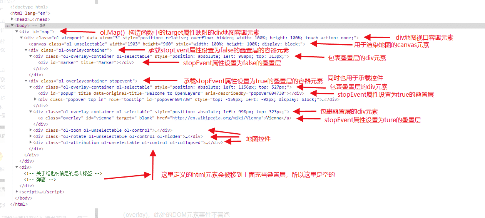

```js
当调用ol.Map()这个构造函数时，OpenLayers地图引擎会在内部创建一个视口容器（viewport container，一个css类名为ol-viewport的div DOM元素）
并将其放置在target属性映射的地图容器元素中。

而在视口容器中将会包含三个子元素：
    canvas元素   --    用于渲染地图

    css类名为ol-overlaycontainer-stopevent的div元素 —— 用于承载控件（control）和stopEvent属性设置为true的叠置层（overlay)，此处的DOM元素事           件不冒泡

    css类名为ol-overlaycontainer —— 用于承载stopEvent属性设置为false的叠置层，此处的DOM元素事件会冒泡
    所以上面示例中用于充当叠置层的html元素都会被移到用于承载叠置层的div元素中。
```

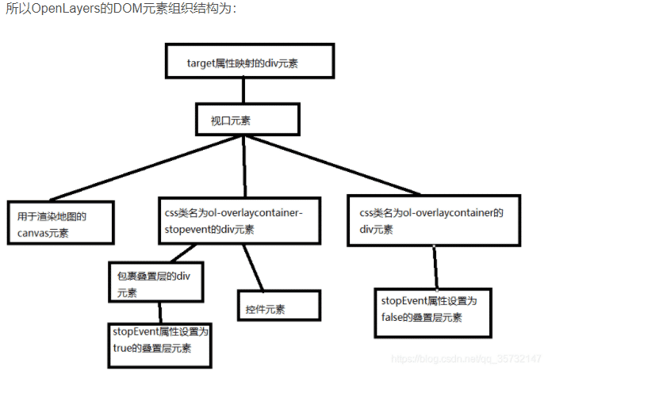

## ol学习

```js
1.style.Icon中设置anchor:[0.5,1]可以让定位图标的最底部对应实际坐标点，视觉效果更好。
```

## 天地图

```js
// 天地图影像
https://t{0-7}.tianditu.gov.cn/DataServer?T=img_w&x={x}&y={y}&l={z}&tk=8232df3467e2da8a1ae909e65a695bfe
// 天地图影像注记
https://t{0-7}.tianditu.gov.cn/DataServer?T=cia_w&x={x}&y={y}&l={z}&tk=8232df3467e2da8a1ae909e65a695bfe
// 天地图矢量
https://t{0-7}.tianditu.gov.cn/DataServer?T=vec_w&x={x}&y={y}&l={z}&tk=8232df3467e2da8a1ae909e65a695bfe
// 天地图矢量注记
https://t{0-7}.tianditu.gov.cn/DataServer?T=vec_w&x={x}&y={y}&l={z}&tk=8232df3467e2da8a1ae909e65a695bfe
```


# cesium

## 本地化部署

```js
//  下载最新代码
// npm install 
// npm run build
// npm run build-docs
```


## 投影支持

```js
Cesium只支持WCS84和墨卡托投影；
其中地形默认为WCS84投影，且一般只支持WCS84投影；
影像数据两种投影都支持，默认为墨卡托投影，WebMercatorTilingScheme平铺方案
如果影像数据为墨卡托投影，则cesium内部会自动进行动态投影矫正，会有一定的计算量，但是不需要额外进行代码编写；
当影像数据为WCS84时，需要手动申明该ImageryProvider的TilingScheme=new Cesium.GeographicTilingScheme()
```

## 加载B3DM优化建议

```js
// 原文：https://blog.csdn.net/weixin_42539678/article/details/122683572
var tileset = new Cesium.Cesium3DTileset({
        url:url,
        skipLevelOfDetail: true,
        baseScreenSpaceError: 1024,
        maximumScreenSpaceError: 256, // 数值加大，能让最终成像变模糊
        skipScreenSpaceErrorFactor: 16,
        skipLevels: 1,
        immediatelyLoadDesiredLevelOfDetail: false,
        loadSiblings: true, // 如果为true则不会在已加载完概况房屋后，自动从中心开始超清化房屋
        cullWithChildrenBounds: true,
        cullRequestsWhileMoving: true,
        cullRequestsWhileMovingMultiplier: 10, // 值越小能够更快的剔除
        preloadWhenHidden: true,
        preferLeaves: true,
        maximumMemoryUsage: 128, // 内存分配变小有利于倾斜摄影数据回收，提升性能体验
        progressiveResolutionHeightFraction: 0.5, // 数值偏于0能够让初始加载变得模糊
        dynamicScreenSpaceErrorDensity: 0.5, // 数值加大，能让周边加载变快
        dynamicScreenSpaceErrorFactor: 1, // 不知道起了什么作用没，反正放着吧先
        dynamicScreenSpaceError: true, // 根据测试，有了这个后，会在真正的全屏加载完之后才清晰化房屋
})var tileset = new Cesium.Cesium3DTileset({
        url:url,
        skipLevelOfDetail: true,
        baseScreenSpaceError: 1024,
        maximumScreenSpaceError: 256, // 数值加大，能让最终成像变模糊
        skipScreenSpaceErrorFactor: 16,
        skipLevels: 1,
        immediatelyLoadDesiredLevelOfDetail: false,
        loadSiblings: true, // 如果为true则不会在已加载完概况房屋后，自动从中心开始超清化房屋
        cullWithChildrenBounds: true,
        cullRequestsWhileMoving: true,
        cullRequestsWhileMovingMultiplier: 10, // 值越小能够更快的剔除
        preloadWhenHidden: true,
        preferLeaves: true,
        maximumMemoryUsage: 128, // 内存分配变小有利于倾斜摄影数据回收，提升性能体验
        progressiveResolutionHeightFraction: 0.5, // 数值偏于0能够让初始加载变得模糊
        dynamicScreenSpaceErrorDensity: 0.5, // 数值加大，能让周边加载变快
        dynamicScreenSpaceErrorFactor: 1, // 不知道起了什么作用没，反正放着吧先
        dynamicScreenSpaceError: true, // 根据测试，有了这个后，会在真正的全屏加载完之后才清晰化房屋
var tileset = new Cesium.Cesium3DTileset({
        url:url,
        skipLevelOfDetail: true,
        baseScreenSpaceError: 1024,
        maximumScreenSpaceError: 256, // 数值加大，能让最终成像变模糊
        skipScreenSpaceErrorFactor: 16,
        skipLevels: 1,
        immediatelyLoadDesiredLevelOfDetail: false,
        loadSiblings: true, // 如果为true则不会在已加载完概况房屋后，自动从中心开始超清化房屋
        cullWithChildrenBounds: true,
        cullRequestsWhileMoving: true,
        cullRequestsWhileMovingMultiplier: 10, // 值越小能够更快的剔除
        preloadWhenHidden: true,
        preferLeaves: true,
        maximumMemoryUsage: 128, // 内存分配变小有利于倾斜摄影数据回收，提升性能体验
        progressiveResolutionHeightFraction: 0.5, // 数值偏于0能够让初始加载变得模糊
        dynamicScreenSpaceErrorDensity: 0.5, // 数值加大，能让周边加载变快
        dynamicScreenSpaceErrorFactor: 1, // 不知道起了什么作用没，反正放着吧先
        dynamicScreenSpaceError: true, // 根据测试，有了这个后，会在真正的全屏加载完之后才清晰化房屋
})
```

## 主要类及方法总结

```js
js:
1.Cesium.Matrix4.IDENTITY 一个常量，代表单位矩阵，任何矩阵*单位矩阵=本身
2.viewer.entities.removeAll() 删除viewer上所有的实体entity
3.HeadingPitchRoll 设置对象的水平方向、俯仰角度和翻滚角度
4.scene.clampToHeightSupported 判断计算机是否支持根据模型或者地形等物体计算点位的附着高度
5.Cesium.Cartesian3.lerp(a,b,c) a~b之间线性计算出在c处的值
6.scene.clampToHeightMostDetailed(cartesians)  在cartesians坐标处计算出对应的附着高度，可能是附着在地形、entity、primitives、3dtiles等上
7.scene.camera.setView 设置相机的位置、方向和变换矩阵
  scene.camera.lookAt() 
8.PolylineOutlineMaterialProperty 用来描述线轮廓的材质
9.PolylineGraphics.depthFailMaterial 用于指定线被深度检测盖住的部分的材质
10.设置viewer.sceneMode和viewer.mapMode2D可以使用2D和2.5地图。
11.viewer.resolutionScale 设置cesium的呈现分辨率的缩放系数
12.d=Cesium.Math.clamp(a,b,c) 用于将c值限定在a~b之间，当c<a时，d=a当c>b时，d=b;否则d=c
13.Cesium.Color.fromCssColorString() 将CSS颜色值转化为Cesium.Color
14.Cesium.ClassificationType 设置对象是否影响地形，3dtiles或两者。
15.viewer.projectionPick 设置相机的投影方式（正射投影或者透视投影），透视投影更符合人类眼睛的观察模式
16.viewer.projectionPicker.viewModel.switchToPerspective() 手动设置相机切换到透视投影
17.Cesium.Transforms.headingPitchRollQuaternion() 根据提供的原点为中心，进行欧拉角计算，得到一个新的四元数，在设置entity的坐标和方向时用到
18.viewer.trackedEntity=entity 设置相机跟踪当前entity
19.PostProcessStageLibrary 常见的后处理函数
20.Cesium.Cartesian3.fromDegreesArray()
   Cesium.Cartesian3.fromDegreesArrayHeights
21.PolylineDashMaterialProperty 定义虚线材质
22.PolylineGlowMaterialProperty 定义发光线材质
23.PolylineArrowMaterialProperty 定义线箭头材质
24.cornerType: Cesium.CornerType.BEVELED 设置图形拐角处的连接类型
25.ploygon.perPositionHeight 设置polygon是否使用每个位置的高度，仅当extrudedHeight=0时，设置ploygon.perPositionHeight=true才生效
26.polygon 可以构造多边形以及多边形体，灵活应用extrudedHeight和perPositionHeight
27.viewer.entities.add() 添加实体
28.viewer.zoomTo()
29.世界坐标转化经纬度：
   	cartographic = Cesium.Cartographic.fromCartesian(cartesian)
	lon = Cesium.Math.toDegrees(cartographic.longitude)
	lat = Cesium.Math.toDegrees(cartographic.latitude)
30.Cesium.Color.clone() 颜色拷贝
31.Cesium.Color.GREEN.withAlpha(0.5) 带透明度的颜色
32.handler = new Cesium.ScreenSpaceEventHandler(scene.canvas) 定义用户输入事件
   handler.setInputAction(fn,type, modifier) 开启type类型输入事件，并设置执行的功能函数 
   handler.destroy() 销毁用户输入事件监听
33.scene.drillPick(movement.endPosition) 根据屏幕坐标深度捕捉图元对象，获得一个对象数组
34.viewer.scene.camera.pickEllipsoid(cartesian2) 根据屏幕坐标计算世界坐标
35.Cesium.Cartesian3.distance(a,b) 计算ab两点间的距离
36.viewer.camera.changed.addEventListener(fn) 开启相机事件监听
   viewer.camera.percentageChanged = 0.1 让相机变得更加灵敏
37.viewer.scene.cartesianToCanvasCoordinates(cartesia3,cartesia2) 将世界坐标映射为屏幕坐标
38.关于entity中graphics的分类：
   billboard 广告牌
   box 构造立方体，中心位置和方向由包含的 Entity 确定
   Corridor 构造走廊，可以挤压成体积
   Cylinder 构造圆柱体、截锥体或者圆锥体，中心位置和方向由包含的 Entity 确定
   Ellipse 构造由长短轴定义的椭圆，可以挤压成体积,中心位置和方向由包含的 Entity 确定
   Ellipsoid 构造椭球体或者球体,中心位置和方向由包含的 Entity 确定
   Label 构造二维标签,中心位置和方向由包含的 Entity 确定
   model 构造基于gltf的模型,中心位置和方向由包含的 Entity 确定
   path 构造entity随时间移动时形成的路径的折线
   plane 构造只有长宽的平面，需要设置其法线属性
   point 构造图形点
   polygon 构造外部形状和任何嵌套孔的线性环的层次结构定义的多边形，可以挤压体积
   polyline 构造线段
   PolylineVolume 构造折线体积，管线等...
   Rectangle 构造矩形，可以挤压成体积
   Wall 构造二维墙体
39.Cesium.HeightReference 设置相对于地形的位置
40.viewer.dataSources.raise(dataSource) 将 dataSource的显示z-index上升一位 
41.Cesium.Camera.·· = Cesium.Rectangle.fromDegrees(73.0, 3.0, 135.0, 53.0);//设置Home位置
   viewer.camera.flyHome(5);
42.Cesium内置了拦截数据相应的方法：如下监听了时钟速率发现变化的事件
  Cesium.knockout
      .getObservable(viewer.clockViewModel, "multiplier")
      .subscribe(function (newValue) {
        console.log(newValue,110);
      });
43.FXAA和MSAA
   FXAA:只是一个后处理技术，对原图绘制完成后，通过算法识别边缘，然后以像素级别进行混合；
   MSAA:MSAA中每个像素点有4个子采样点，每个三角形对每个像素点只在中心点着色1次，再把计算结果根据深度和覆盖信息保存到对应的子采         样点，最后对4个采样点取均值作为最终的像素颜色
44.后处理中PostProcessStageCollection和PostProcessStage、PostProcessStageComposite、PostProcessStageLibrary的关系：
  PostProcessStageCollection最大，是PostProcessStage或者PostProcessStageComposite的集合， viewer.scene.postProcessStages.add()将后处理应用至场景中；
  PostProcessStageComposite是多个PostProcessStage的集合，在执行逻辑上是同时进行的；
  PostProcessStageLibrary是用于创建通用的PostProcessStage的函数，即事先cesium定义好了的PostProcessStage,不需要自定义fragmentshader；
```

## flyto

```js
//xxx 一般为3dtidle和model等实体对象
viewer.flyto(xxx);

//xxx 一般为明确的坐标地点destination，还需要设置orientation方位角
camera.flyto(xxx);
```

## clampToHeight

```js
//返回cartesian位置处objectsToExclude上的夹紧位置，即紧贴实体的位置
clampToHeight(cartesian, objectsToExclude); //objectsToExclude 一般为实体或3DTiles
```

## sampleTerrain

```js
//在terrain数据集的最大可用图块级别上获得高程
Cesium.sampleTerrainMostDetailed(terrainProvider, positions);

//在terrain数据集的level级别上获得高程
Cesium.sampleTerrain(terrainProvider, level, positions);
```

## 项目实战

```js
1.工具栏
2.基础数据展示：
  行政区划
  建筑
  道路
  地铁
  兴趣点
  模型
  地下管网
3.

```

# webgl

## model、view 矩阵分析

```js
//https://zhuanlan.zhihu.com/p/34672417
正如把大象装进冰箱一样，把3D世界中的物体呈现在我们人眼所见的屏幕上也需要三步：把物体放入世界中，将摄像头指向物体，最后把摄像头所观察到的事物投影到屏幕。这三个环节的执行是通过将物体的齐次坐标与不同阶段所需的矩阵相乘得到的.


总结：通过观察矩阵，我们把物体转移到了摄像头面前，之后旋转摄像头视角，准备把视角范伟内的物体通过投影矩阵映射到屏幕。
```

## 基本绘制步骤

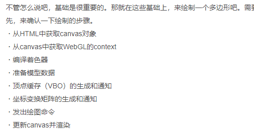

# Python

# GIT 基本使用

## 解决冲突

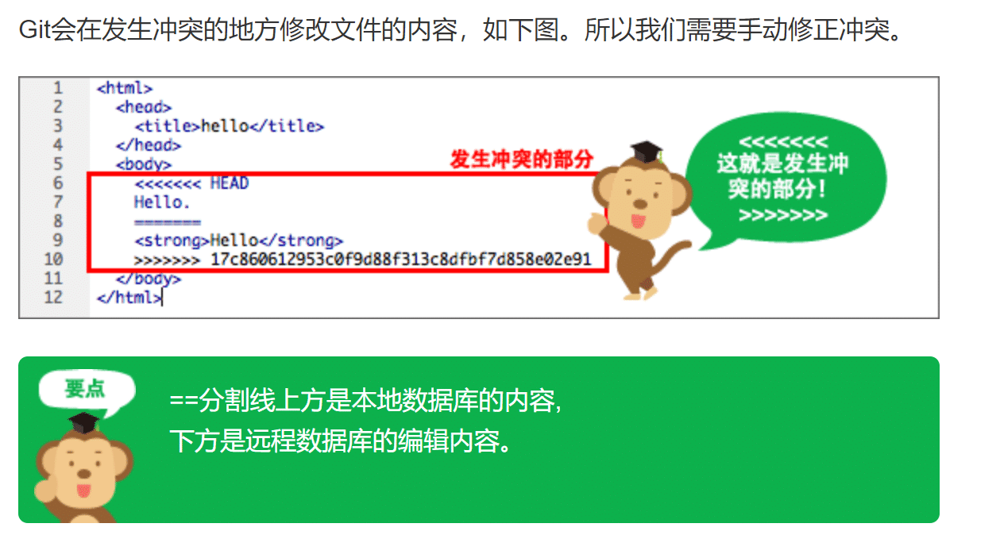

```JS
如上图：

==分割线上方是本地数据库的内容,
下方是远程数据库的编辑内容。

<<<<<<<<<
    发生冲突的部分
>>>>>>>>>

```

## TortoiesGit 的使用

```js
1.https://backlog.com/git-tutorial/cn/intro/intro1_2.html
2.https://blog.csdn.net/u011966339/article/details/106250920
```

# 软知识

## 传参

```js
// request payload
'content-type': 'application/json; charset=utf-8'

//form data
'Content-Type': 'application/x-www-form-urlencoded;charset=UTF-8'
```

## scss

```js
// 在calc中使用scss变量时 #{变量}
width: calc(#{$base-width} - 80px);
```

## 局域网IP配置

```js
// IP地址：192.168.1.3
// 子网掩码：255.255.255.0
// 默认网关 192.168.1.1


// 首选DNS服务器：114.114.114.114
// 备用DNS服务器：114.114.115.115

```


## 插件和 SDK 的区别

```js
//以cesium为例
插件：就是自己基于cesium的某个部分（比如Layer或者entity）做的二次开发。最终项目里面不包括cesium源码，他的运行和使用需要自己导入cesium作为依赖。

SDK：也是基于cesium做的维持开发，但最终项目包括了自己开发的代码和cesium的源码以及其他依赖插件和环境等。
```

## 常用工具集合

```js
1.popmotion.js  取代锚点定位的好工具，滚动到指定区域。
2.https://shields.io/category/social 获得github项目实时的星星数
3.vxe-table 强大的vue 表格插件
4.npm install coordtransform 一个提供了百度坐标（BD09）、国测局坐标（火星坐标，GCJ02）、和WGS84坐标系之间的转换的工具模块
5.npm install vue-quill-editor --save  vue富文本编辑器的使用
  quill-image-resize-module  支持图片扩展
6.vue-drag-resize  可对元素鼠标拖拽和拉升缩放
7.shpjs  npm包，解析shp，使用时注意控制台的错误，可在github上找到解决方案
8.crypto-js加密解密
9.Chalk 为终端添加样式
10.AbortController可以终止axios得到请求
11.nodemon electron热加载
12.npm install --save vue-js-modal  添加vue2中的弹出框
13.npm install portal-vue@2.1.7   类似vue3的teleport ，可以将自定义组件传输到任意节点中
14.picsum获得随机图片，常用于测试使用    https://picsum.photos/200/200  得到宽高200px的随机图片
15.nativefier可以快速将网站打包成桌面程序  https://github.com/nativefier/nativefier
16.sharp高性能nodejs图片处理工具
17.npm i vue3-pdf-app vue3中pdf预览
18.npm install --save @panzoom/panzoom  对图片、视频等任意元素进行缩放、拖拽
19.富文本编辑器wangeditor    网址：https://www.wangeditor.com/v5/
```
